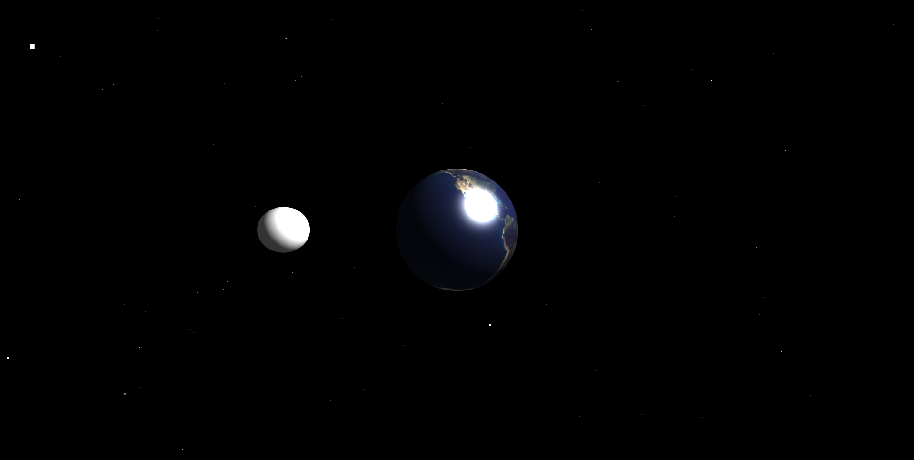
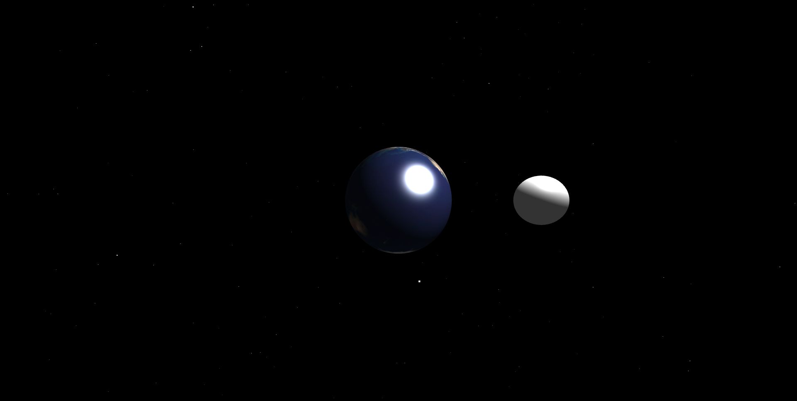

# 🌍 Earth with Orbiting Moon - Three.js Project

This is a 3D space simulation using [Three.js](https://threejs.org/). It features a rotating **Earth** with realistic textures, an orbiting **Moon**, and a star-filled **galaxy background**. The animation includes lighting, rotation, and orbital mechanics in a smooth and visually appealing way.

---

## 🚀 Live Preview

🔗 [Click here to view the live demo](https://earth-moon-6v0hp3tpj-rajnisht7s-projects.vercel.app/)

> Replace the link with your actual deployment (GitHub Pages, Netlify, or Vercel).

---

## 📸 Screenshots

### 🌍 Earth and Moon

---

## 🧱 Features

- 🌍 Realistic Earth with texture map
- 🌕 Moon revolving around Earth
- ✨ Starfield using `THREE.Points`
- 💡 Ambient and Point lighting
- 📱 Responsive canvas resizing
- 🔁 Smooth animation with orbit logic

---

## 📂 File Structure

